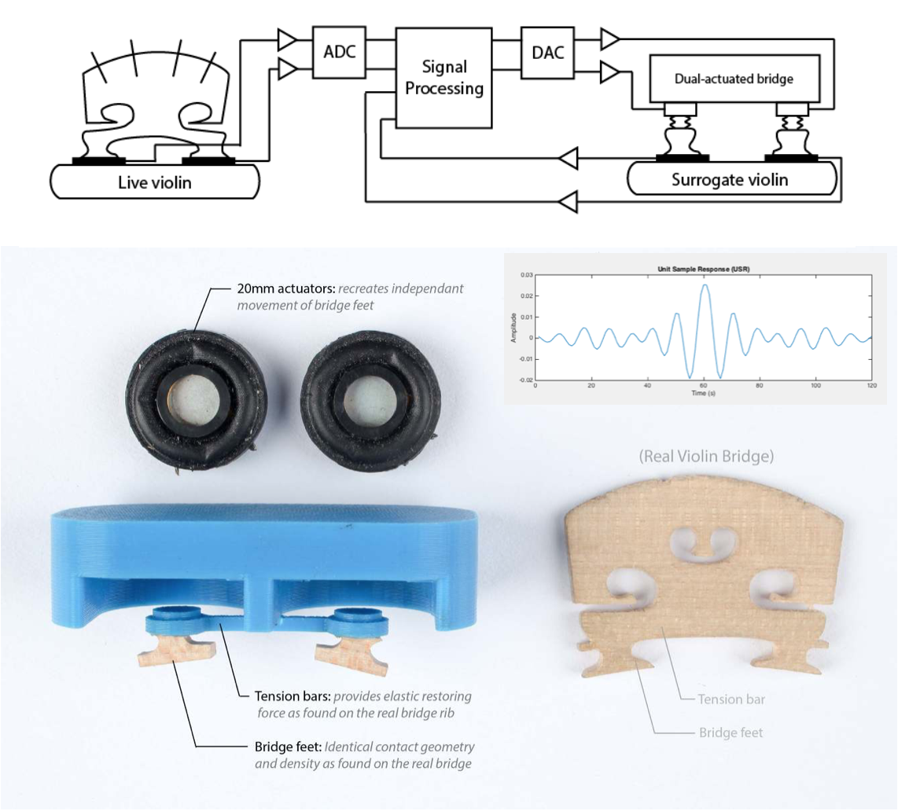
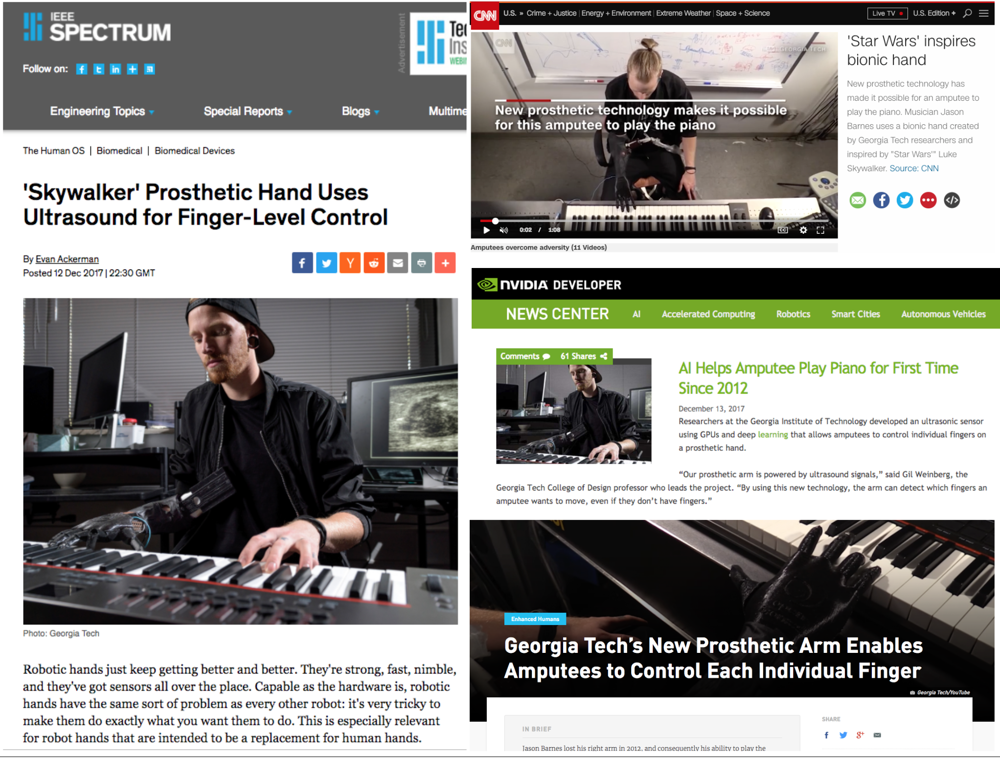
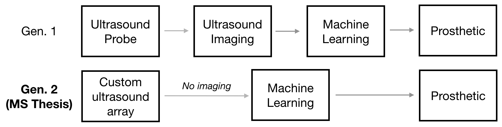
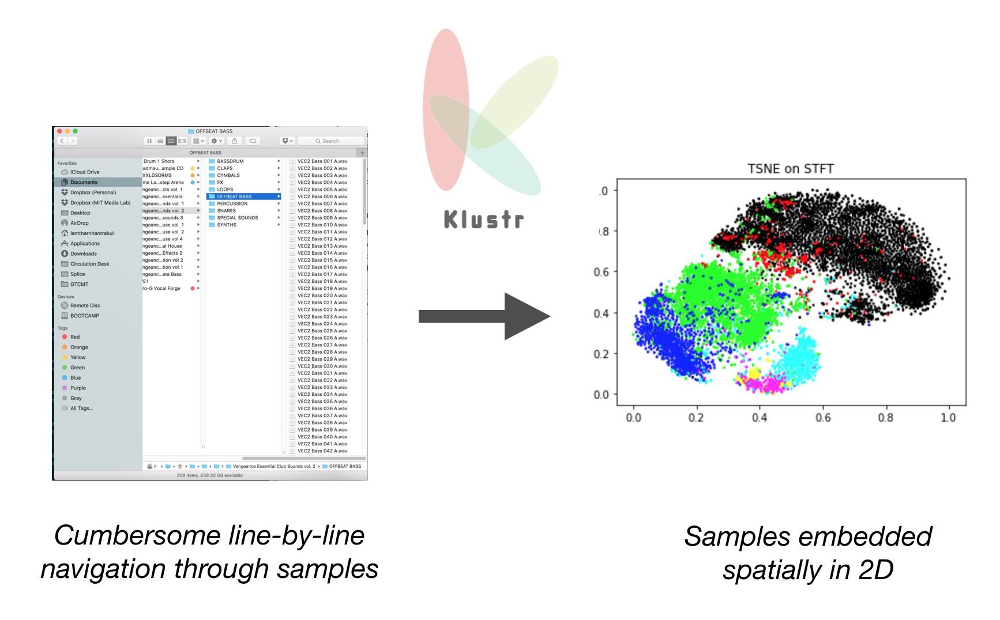

# Google AI Residency 2018 Application
## **Lamtharn "Hanoi" Hantrakul**

The following are curated projects, videos and links grouped roughly into my areas of expertise:

* Physics + Electrical Engineering

* Industrial Design + Mechanical Engineering

* Deep Learning + Machine Learning

* Audio/Music+ML

--> My full [GitHub](https://github.com/lamtharnhantrakul)

--> My full [Portfolio](http://cargocollective.com/lh-hantrakul)

## Physics + Digital Signal Processing
### Patent-pending Surrogate Soundboard System

My BS Thesis in Applied Physics from Yale University develops a patent-pending mechanism for transferring acoustic vibrations from a live violin to a remote violin using custom-fabricated transducers and digital inverse filters. This enables a "live" violin to be stream in real-time to a "surrogate" violin located in another concert hall through standard Web Audio protocols. 

[Full documentation](http://cargocollective.com/lh-hantrakul/Surrogate-Soundboards-Mark-II) available

Pat. Pending #1501004501. **Hantrakul, L.** _“A surrogate soundboard system for the violin”_ Filed 10/8/2015. Department of Intellectual Property, Thailand.

**Hantrakul, L.** , Kuc, R. Wilen, L. _[“Surrogate Soundboards for novel transmission of violin audio”](https://www.dropbox.com/s/0ywxxt5kxx49h3z/ICMC%20Surrogate%20L.%20Hantrakul%202016.pdf?dl=0)_. Proceedings of the International Computer Music Conference (ICMC 2016) at HKU University of the Arts in Utrecht, The Netherlands.

## Industrial Design + Mechanical Engineering
### Fidular

_Fidular_ is a patent-pending and award-winning cross-cultural modular fiddle system, placing in the top 5% of designs at [A' Design Awards](https://competition.adesignaward.com/design.php?ID=50765) and winning Student Runner Up to the [Core 77 Design Awards](http://designawards.core77.com/Open-Design/64638/Fidular-Modular-Fiddle-System). It enables musicians and luthiers to detach and interchange components such as strings and chambers between fiddles from across the Asia and the Middle East. A print of this design is currently in special exhibition at the [Musical Instruments Museum](https://mim.org/) in Phoenix, AZ and accepted to [NIME 2017 conference](https://www.dropbox.com/s/3mfkh3yc6ul5qlm/L%20Hantrakul%20NIME16%20Fidular%20UPLOAD.pdf?dl=0).

[Full documentation](http://cargocollective.com/lh-hantrakul/fidular) available.

<left>
<iframe width="610" height="343" src="https://www.youtube.com/embed/B_chlvO4thU" frameborder="0" allowfullscreen></iframe>
</left>

Pat. Pending #1601000261. **Hantrakul, L.** _“A shape-shifting waveguide and interchangeable front-panel system for Asian and Middle Eastern Fiddles”_ Filed 20/1/2016 Department of Intellectual Property, Bangkok, Thailand.

Pat. Pending #1501005900. **Hantrakul, L.** _“A magnetic and modular system for Asian fiddles”_ Filed 29/9/2015. Department of Intellectual Property, Thailand.

## Deep Learning + Machine Learning
### Skywalker Prosthetic
I am part of an [inter-departmental team](http://www.news.gatech.edu/2017/12/11/force-strong-amputee-controls-individual-prosthetic-fingers) spanning AI, ultrasound and physiology that develops novel prosthetics leveraging ultrasound and machine learning. Our system delivers first-in-class finger-by-finger control by amputees, enabling high-dexterity tasks like playing piano; an impossible feat using today's sensing on conventional prosthetics. Our work was featured last month (December 2017) by [NVidia](https://news.developer.nvidia.com/ai-helps-amputee-play-piano-for-first-time-since-2012/), [IEEE](https://spectrum.ieee.org/the-human-os/biomedical/devices/skywalker-prosthetic-hand-uses-ultrasound-sensors-for-fingerlevel-control), [CNN](http://www.cnn.com/videos/us/2017/12/13/bionic-hand-luke-skywalker-amputee-play-piano-orig.cnn) and many other news sources. By using ultrasound over traditional electromyography (EMG), we are able to "see" deeper muscle activities in the arm.

I am one of three members that implement ML+DSP on this project.

Publication pending for February 2018 (university patent delay)

### MS Thesis: ultrasound-based finger-by-finger regression using embedded single elements

Conventional prosthetics electromyography (EMG) to sense muscle activation from the surface of an amputee's residual muscles. My MS Thesis develops the second iteration of a new ultrasound-based system outlined above. I use Deep Learning directly on raw ultrasound pulses to output continuous regressions. This approach skips the traditional imaging step and enables the system to be miniaturized substantially by custom designing the ultrasound transducer array. My thesis is advised by Gil Weinberg (Georgia Tech), Byron Boots (Google Brain) and Mason Bretan (Futurewei Inc.)

Due to university patents/invention disclosures, I cannot share my GitHub repository nor an image of this setup until my Thesis is published in May 2018.

### SmartEar Deep Learning Auditory Scene Analysis
[SmartEar](https://www.smartear.ai/) is a voice-centric, AI-enabled and patended in-the-ear-canal (not your regular out-of-ear-canal earbuds!) earpiece. As a remote part-time audio deep learning engineer, I develop deep learning-based Auditory Scene Analysis (ASA) that enable SmartEar to identify its acoustic environment (e.g indoor vs outdoor, loud environment vs. quiet environment) using CNN's on beamformed audio from the earpiece.

<left>
<iframe width="610" height="343" src="https://www.youtube.com/embed/4dH0JE-D420" frameborder="0" allowfullscreen></iframe>
</left>

This work is a joint industry-academia research project between SmartEar and the Robotic Musicianship Group (my affiliation) at the Georgia Institute of Technology.

## Audio & Music + ML
### Extending Magenta's NSynth
Recently featured on the [Google Magenta Blog](https://magenta.tensorflow.org/blog/2017/09/12/outside-hacks/), our hack won the Outside Lands music hackathon! I led the winning team and documented how we connected the open sourced NSynth model to a real-time data streaming system that enabled a group of phones to control where on the latent space Z in the autoencoder the waveform was being generated from.

[GitHub](https://github.com/lamtharnhantrakul/mSynth) repository

<left>
<iframe width="610" height="343" src="https://www.youtube.com/embed/DIHNMGTdo_w" frameborder="0" allowfullscreen></iframe>
</left>

### DQN's for Robotic Musicians
The choice of what musical note to play next is a process that combines multiple modalities such as sight, sound, memory and the physical body playing the instrument. ML and DL models for music often treat a sequence of notes pure uni-modal "statistical occurence". This project works towards a joint representation between a robot's DOF's and musical cognition to inform the robot how it should path plan and coordinate its arms during musical improvisation. I develop models for learned bi-manual and tetra-manual coordination that build on top of DeepMind's Atari-playing DQN (like multi-agent pong with 4 paddles).

[GitHub](https://github.com/lamtharnhantrakul/shimon_hero_DQN) repository for Baseline results and full documentation

[GitHub](https://github.com/lamtharnhantrakul/ShimonHeroThesis) repository for in-progress implementation using OpenAI's reference RL algorithms

### GestureRNN
In a conversation with Doug Eck from the Google Magenta team, we discussed how humans create art in "low dimensional" spaces e.g. the movements of a brushstroke vs "high dimensional" spaces e.g. the final RGB values of every pixel. Inspired by Magenta's _SketchRNN_, I developed a system where an RNN draws musical gestures on the surface of a XY pad learnt from an expert musician. The RNN doesn't generate the waveforms directly, but learns how to navigate the sonic space on the XY pad to generate music.

[GitHub](https://github.com/lamtharnhantrakul/GestureRNN-ML4Lightpad) repository with full documentation and code

<left>
<iframe width="610" height="343" src="https://www.youtube.com/embed/VgoVGpllaSY" frameborder="0" gesture="media" allow="encrypted-media" allowfullscreen></iframe>
</left>

### Klustr: visualization of large audio datasets
High dimensional data such as audio is often organized using simple high level descriptors like `vocal_shout_1.wav` or `funky_bass_1.wav`. However, these labels do not capture nuances between sounds? How similar are `vocal_shout_1.wav` and `vocal_shout_5.wav`? We develop a pipeline that selects the best features (like MFCC's, STFT and WaveNet) and dimensionality reduction techniques (PCA, TSNE, UMAP) to create a 2D map of similar sounds. We intend for this tool to be used by content creators in entertainment, audio production and music production to navigate large sample banks.

[GitHub](https://github.com/lamtharnhantrakul/klustr) repository with full documentation and code

### Cross-modal CNN-LSTMs for musical hallucinations
We train a neural network to regress image features from a video of a xylophone being struck, to the corresponding audio features. Briefly, we define an audio feature _s(t)_ computed from the short-time fourier transform of the audio signal and quantized to the nearest known xylophone frequency (like a pitch _chroma_). We define an input "space-time image" as 3 consecutive grayscale images. These are fed through a CNN-LSTM architecture. Once trained, the idea is to get the neural network to "see" xylphones out of everyday objects that are arranged like an instrument, but do no produce sound in real life. The neural network would "hallucinate" the sound of instruments from these everyday objects.

[GitHub](https://github.com/lamtharnhantrakul/auditory_hallucinations_CNN-LSTM) repository with full documentation and code

<iframe width="610" height="343" src="https://www.youtube.com/embed/23lJOX4Ioo4" frameborder="0" allowfullscreen></iframe>

## Contact

hanoi7 at gmail dot com
