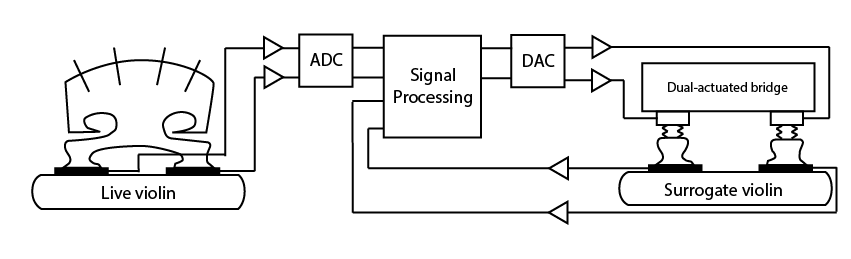
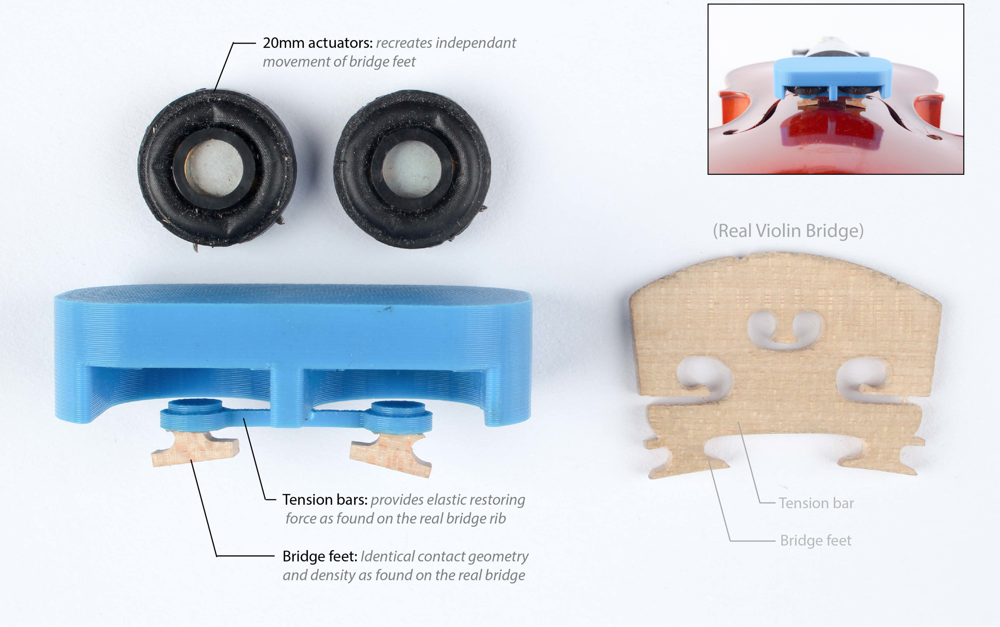
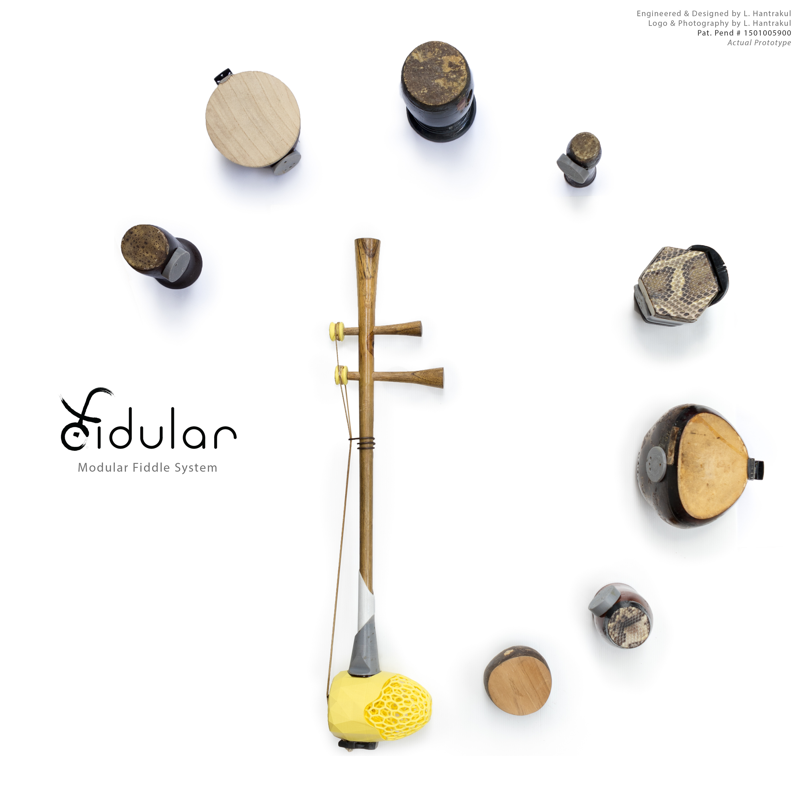
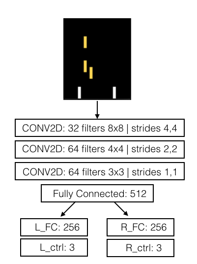
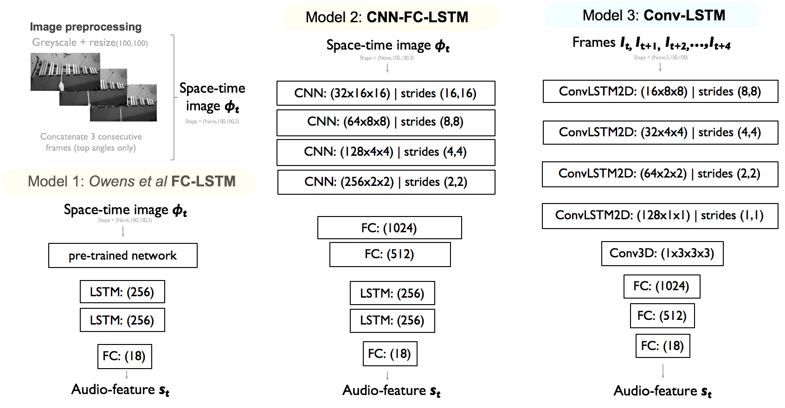
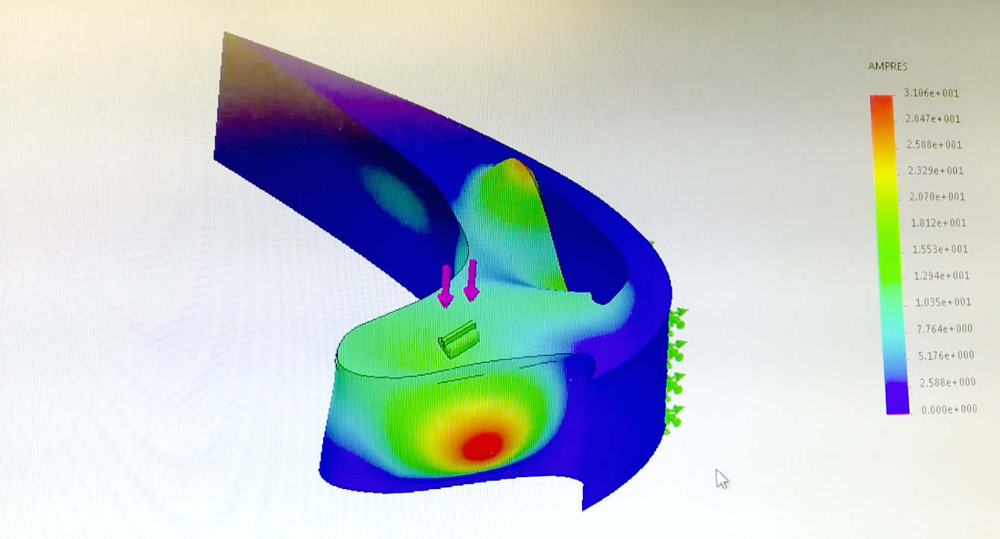
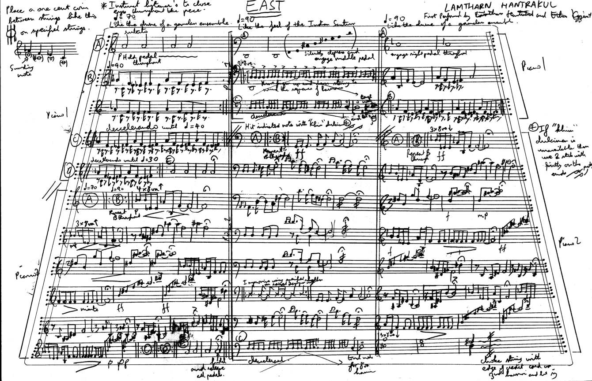

# Google AI Residency 2018 Application
# **Lamtharn "Hanoi" Hantrakul**

The following links are curated in the order they were presented in my Cover Letter.

## Extending Magenta's NSynth

Recently featured on the [Google Magenta Blog](https://magenta.tensorflow.org/blog/2017/09/12/outside-hacks/), our hack won the Outside Lands music hackathon! I led the winning team and documented how we connected the open sourced NSynth model to a real-time data streaming system that enabled a group of phones to control where on the latent space Z in the autoencoder the waveform was being generated from. 

<iframe width="560" height="315" src="https://www.youtube.com/embed/DIHNMGTdo_w" frameborder="0" allowfullscreen></iframe>

## Patent-pending Surrogate Soundboard System

My BS Thesis in Applied Physics from Yale University develops a patent-pending mechanism for transferring acoustic vibrations from a live violin to a remote violin using custom-fabricated transducers and digital inverse filters. A version of my thesis appears as a paper in [ICMC 2016](https://www.dropbox.com/s/0ywxxt5kxx49h3z/ICMC%20Surrogate%20L.%20Hantrakul%202016.pdf?dl=0). Full documentation available [here](http://cargocollective.com/lh-hantrakul/Surrogate-Soundboards-Mark-II)

Pat. Pending #1501004501. **Hantrakul, L.** _“A surrogate soundboard system for the violin”_ Filed 10/8/2015. Department of Intellectual Property, Thailand.

## Fidular

_Fidular_ is a patent-pending and award-winning cross-cultural modular fiddle system, placing in the top 5% of designs at [A' Design Awards](https://competition.adesignaward.com/design.php?ID=50765) and winning Student Runner Up to the [Core 77 Design Awards](http://designawards.core77.com/Open-Design/64638/Fidular-Modular-Fiddle-System). It enables musicians and luthiers to detach and interchange components such as strings and chambers between fiddles from across the Asia and the Middle East. A print of this design is currently in special exhibition at the [Musical Instruments Museum](https://mim.org/) in Phoenix, AZ and accepted to [NIME 2017 conference](https://www.dropbox.com/s/3mfkh3yc6ul5qlm/L%20Hantrakul%20NIME16%20Fidular%20UPLOAD.pdf?dl=0). Full documentation available [here](http://cargocollective.com/lh-hantrakul/fidular). 

<iframe width="560" height="315" src="https://www.youtube.com/embed/B_chlvO4thU" frameborder="0" allowfullscreen></iframe>

Pat. Pending #1601000261. **Hantrakul, L.** _“A shape-shifting waveguide and interchangeable front-panel system for Asian and Middle Eastern Fiddles”_ Filed 20/1/2016 Department of Intellectual Property, Bangkok, Thailand.

Pat. Pending #1501005900. **Hantrakul, L.** _“A magnetic and modular system for Asian fiddles”_ Filed 29/9/2015. Department of Intellectual Property, Thailand.

## MS Thesis in Deep Reinforcement Learning

The choice of what musical note to play next is a process that combines multiple modalities such as sight, sound, memory and the physical body playing the instrument. ML and DL models for music often treat a sequence of notes pure uni-modal "statistical occurence". My thesis uses a joint representation of a robot's DOF's and musical cognition to inform the robot how it should path plan and coordinate its arms during musical improvisation. I develop models for learned bi-manual and tetra-manual coordination that build on top of DeepMind's Atari-playing DQN (like multi-agent pong with 4 paddles).

Baseline results and documentation available through [this repository](https://github.com/lamtharnhantrakul/shimon_hero_DQN)
In-progress Thesis implementation using OpenAI's reference RL algorithms available through [this repository](https://github.com/lamtharnhantrakul/ShimonHeroThesis)

## SmartEar Deep Learning Auditory Scene Analysis

[SmartEar](https://www.smartear.ai/) is a voice-centric, AI-enabled and patended in-the-ear-canal (not your regular out-of-ear-canal earbuds!) earpiece. As a remote part-time audio deep learning engineer, I develop deep learning-based Auditory Scene Analysis (ASA) that enable SmartEar to identify its acoustic environment (e.g indoor vs outdoor, restaurant vs office) using only the beamformed audio from the earpiece. 

Unfortunately, I can't share company code directly =(

<iframe width="560" height="315" src="https://www.youtube.com/embed/4dH0JE-D420" frameborder="0" allowfullscreen></iframe>

## Cross-modal CNN-LSTMs for silent videos of musical instruments

We train a neural network to regress image features from a video of a xylophone being struck, to the corresponding audio features. Briefly, we define an audio feature _s(t)_ computed from the short-time fourier transform of the audio signal and quantized to the nearest known xylophone frequency (like a pitch _chroma_). We define an input "space-time image" as 3 consecutive grayscale images. These are fed through a CNN-LSTM architecture. Once trained, the idea is to get the neural network to "see" xylphones out of everyday objects that are arranged like an instrument, but do no produce sound in real life. The neural network would "hallucinate" the sound of instruments from these everyday objects.

<iframe width="560" height="315" src="https://www.youtube.com/embed/23lJOX4Ioo4" frameborder="0" allowfullscreen></iframe>

Full documentation and code available through this [repository](https://github.com/lamtharnhantrakul/auditory_hallucinations_CNN-LSTM)

## CNN's for (ommitted due to university patent process)
Georgia Tech Press Release scheduled for November 2017. We use (xxx) sensors coupled with machine learning to provide continuous control of a prosthetic piano-playing hand instead of traditional EMG muscle sensors. 

## Additional links

My [full portfolio](http://cargocollective.com/lh-hantrakul) contains projects in Physics, Mechanical Engineering, Electrical Engineering and Industrial Design. My [original music](http://cargocollective.com/lh-hantrakul/Selected-Compositions) is also available online.

## Contact

hanoi7 at gmail dot com
